# Ralli 


## Functionalities:
(1) Core Features:
  - Facebook authentication
  - Creating your own groups
  - Add people to a group by email
  - Real time chat in group with friends
  - Real time event creating
  - Real time event rendering on map
  - Real time feed and invitations
  - Attending events
  - Invite your groups or friends
  - Suprise button offers randomized event look up

####Loading page
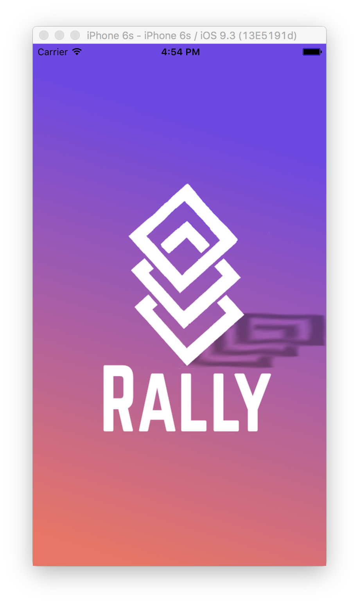

####Login/Singup page

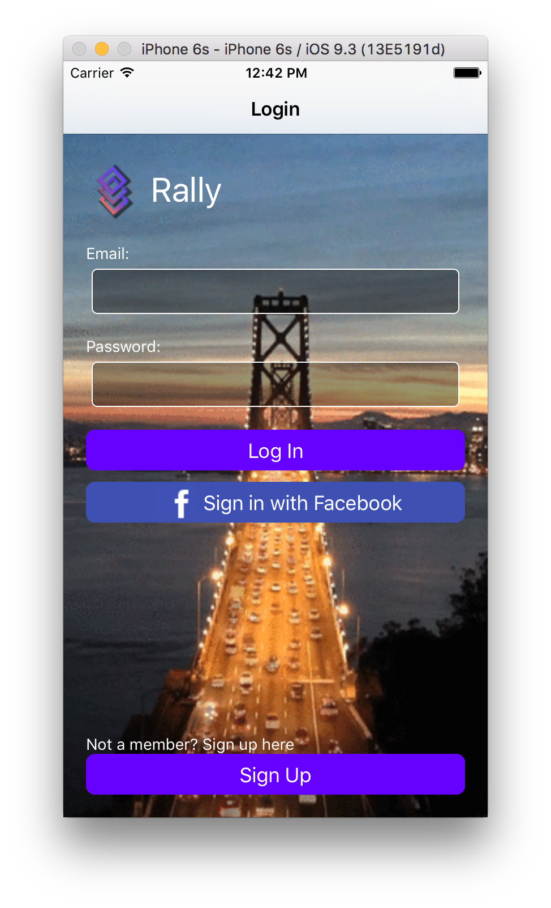
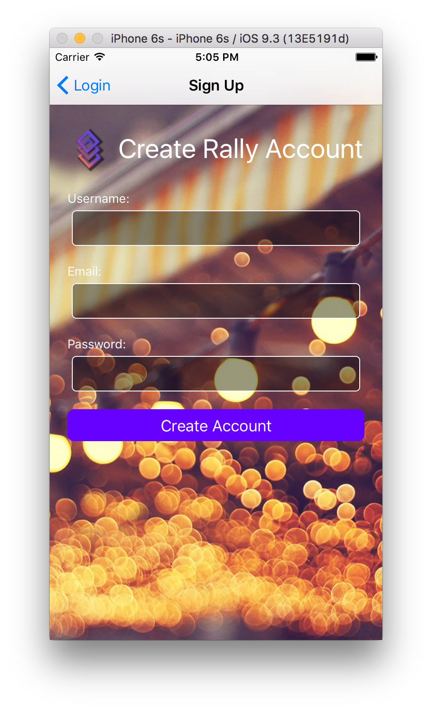

####Ralli marker map page
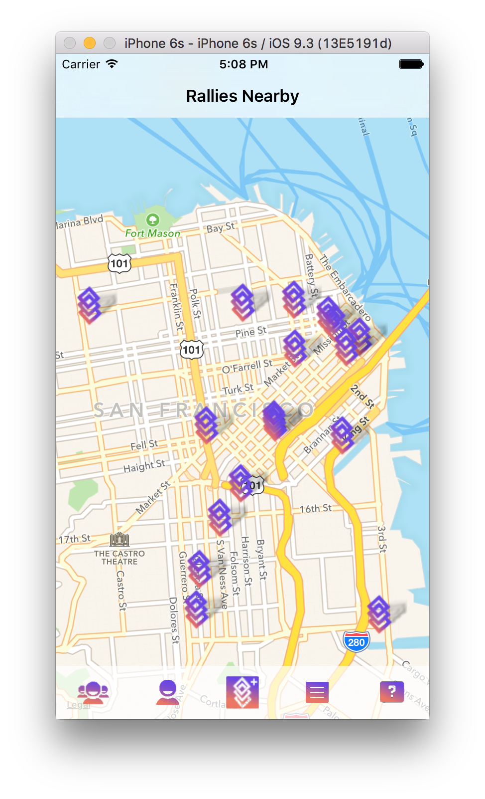
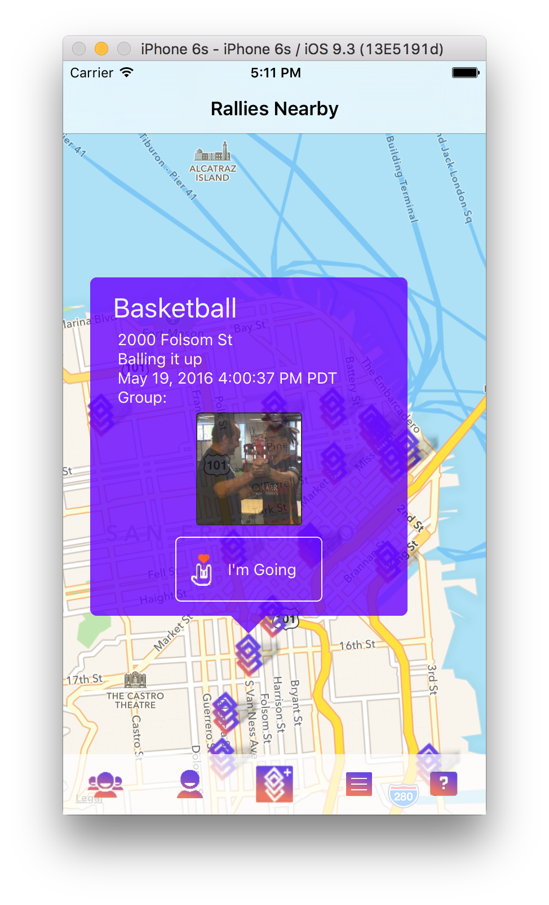

####Group page & create a new group
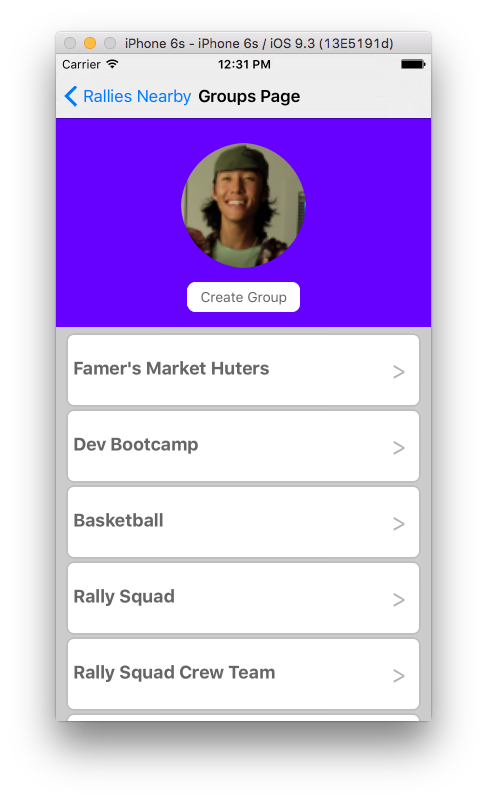
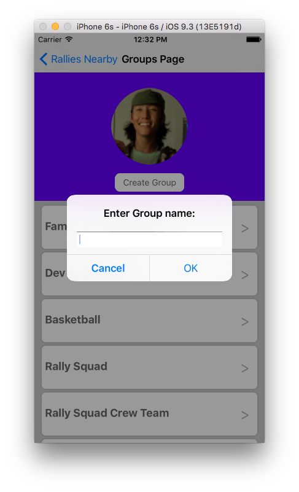

####Chat in a group & add a user to a group 
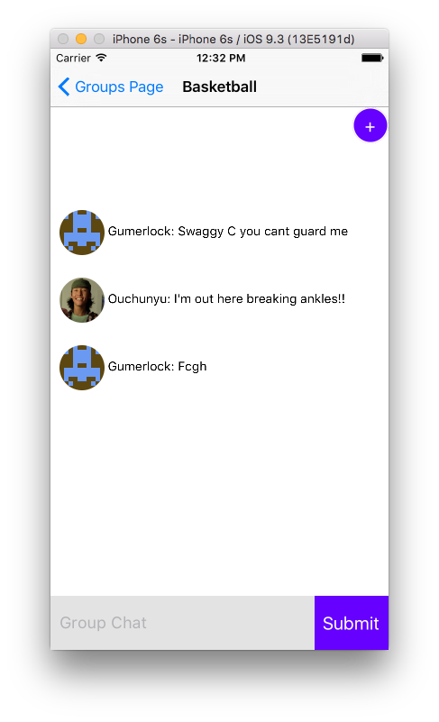
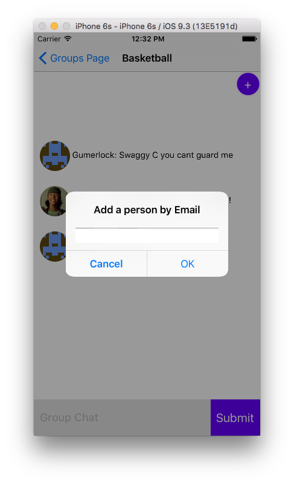

####Create a event & invite your groups to an event
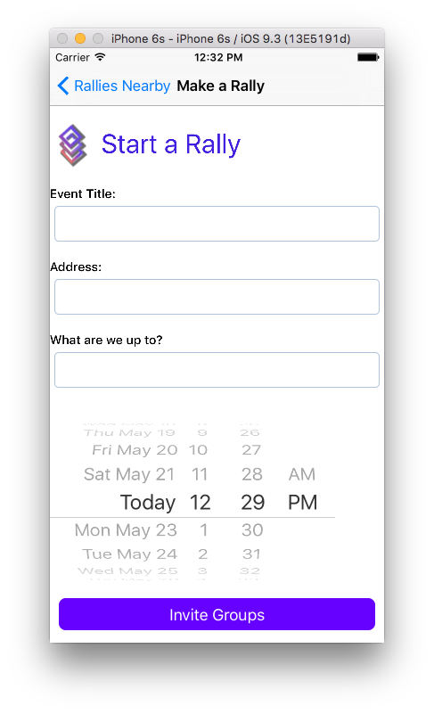
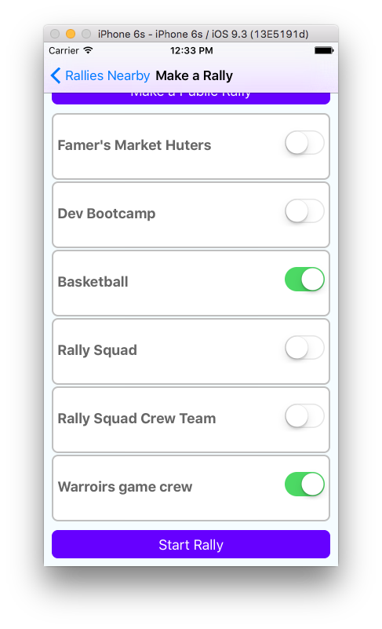

####Real time notification & user profile
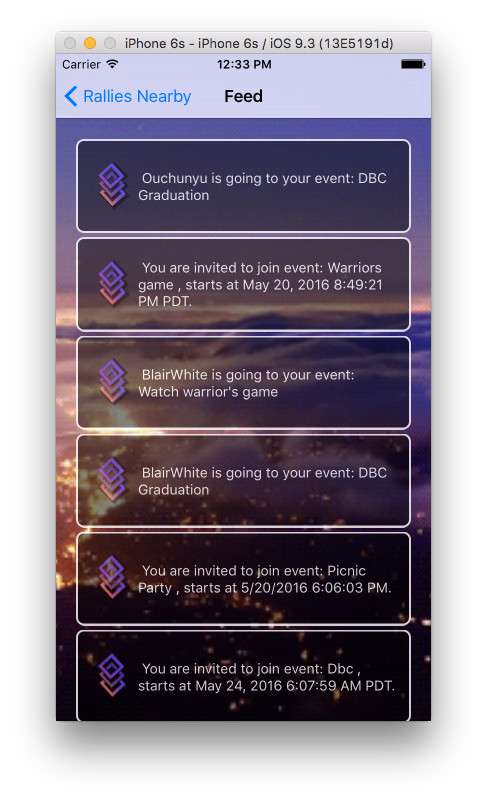
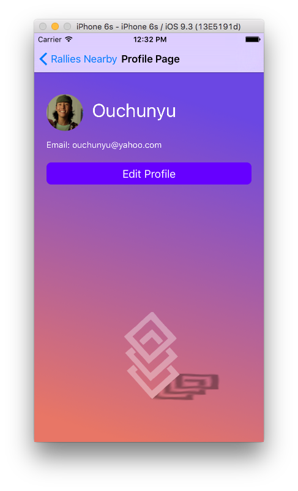

####Randomized event look up
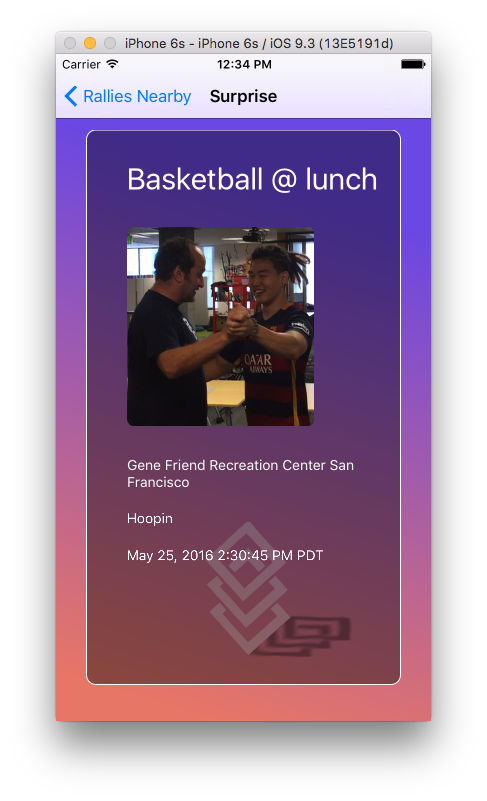


##Tech stack used:
React Native
Firebase

##Test it on your machine locally
- Clone this repo ```git clone https://github.com/OUCHUNYU/Ralli.git```
- ```cd Ralli```
- run `npm install` in your command line tool
- Open Ralli.xcodeproj in XCode
- Press cmd+r to build it


## Collaborators: 
- Eric 
- Miqueas
- Kevin
- Blair
- Chunyu


## Note to all collaborators:
** All warning messages are disabled, to activate go change** <br />
```javascript
jsCodeLocation = [NSURL URLWithString:@"http://localhost:8081/index.ios.bundle?platform=ios&dev=true"];
```
<br />
**to**
<br />
```javascript
jsCodeLocation = [NSURL URLWithString:@"http://localhost:8081/index.ios.bundle?platform=ios&dev=false"];
```

